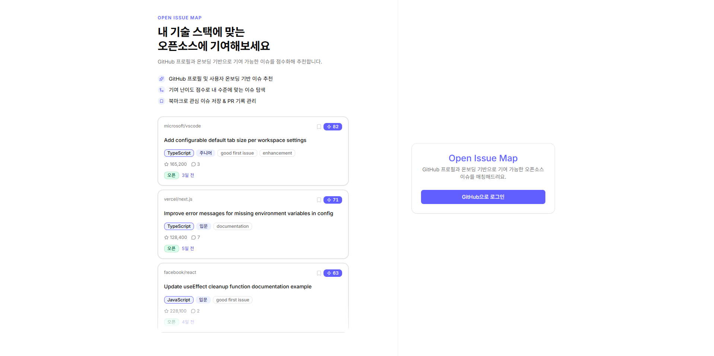
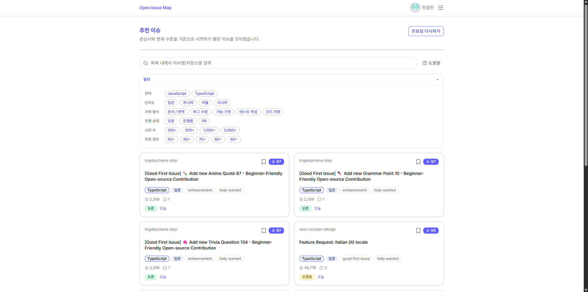
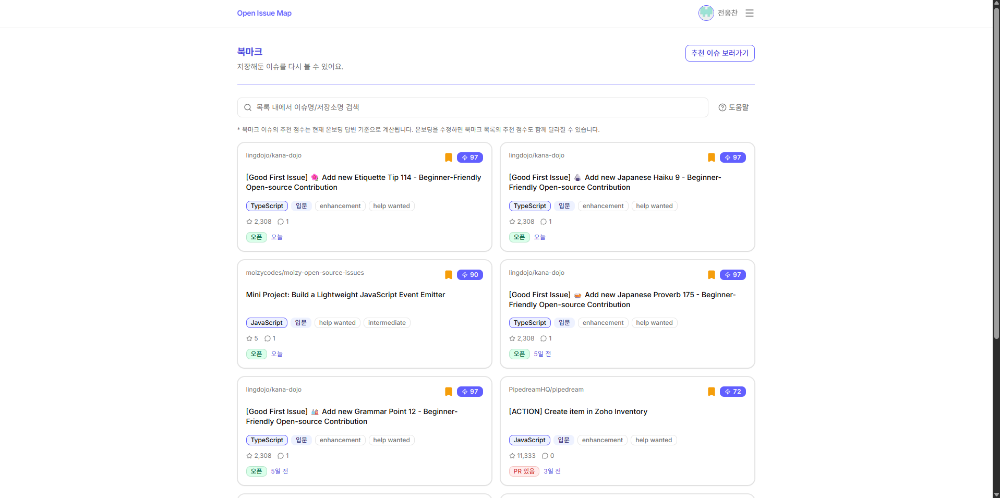

# Open Issue Map

> 오픈소스에 기여하고 싶지만 **어디서 어떻게 시작할지 모르는** 개발자를 위한 이슈 추천 서비스입니다.

**서비스 바로가기:** [https://openissuemap.com](https://openissuemap.com)

---

## 한눈에 보기

Open Issue Map은 “오픈소스에 기여하고 싶지만 어디서 시작할지 모르는 사용자”를 위한 추천 서비스입니다.

GitHub 계정으로 로그인한 뒤 간단한 온보딩 정보를 입력하면 GitHub 이슈 후보를 수집해 추천 점수를 통해 사용자에게 맞는 이슈 목록을 보여줍니다.

## 핵심 기능

| 기능 | 설명 |
| --- | --- |
| **사용자 온보딩** | 사용자의 경험·언어·기여방식·기여목적 등을 수집 |
| **맞춤 이슈 추천** | 언어·난이도·기여유형·경쟁도·시간·목적·저장소 인지도를 기준으로 추천 점수 산정 |
| **북마크** | 관심 이슈 저장, GitHub API 장애 시에도 DB 저장 정보 표시 |
| **PR 히스토리** | 외부 저장소에 제출한 PR 기록과 통계 확인 |

---

## 기술 스택

| 영역 | 기술 | 선택 이유 |
| --- | --- | --- |
| Framework | Next.js 15 App Router (React 19) | 서버 컴포넌트·Route Handler·인증 보호 레이아웃을 단일 앱에서 분리하기 위해 |
| UI | Tailwind CSS v4, shadcn/ui, Radix UI | 접근성 있는 Radix primitive와 디자인 토큰 기반 스타일링으로 빠르게 일관된 UI 구성 |
| Language | TypeScript strict | API 응답·추천 점수 모델처럼 데이터 형태가 중요한 영역에서 런타임 오류 예방 |
| Auth | NextAuth v5, GitHub OAuth | OAuth 인증 흐름과 세션/token을 통합 관리 |
| Database | Neon PostgreSQL | 사용자·프로필·북마크처럼 관계가 명확한 데이터를 서버리스 PostgreSQL로 관리 |
| Server State | TanStack Query v5 | pagination·cache·mutation을 컴포넌트에서 분리해 관리 |
| Validation | Zod v4 | Route Handler 입력값을 도메인 로직 진입 전에 명시적으로 검증 |
| Test | Vitest | 추천 점수·필터·Route Handler·인증 테스트, ESM 모듈 테스트에 적합 |

---

## 아키텍처

```text
Browser (TanStack Query — staleTime 캐싱, 무한스크롤)
  ↕ fetch internal API / JSON response

Next.js App Router (Vercel)
  middleware: 루트(/) 진입 시 auth · onboarding 리다이렉트
  Route Handlers (BFF)
    - requireGithubToken() 또는 auth()
    - Zod 입력 검증
    - Domain Service 호출

  ↕ service call / result

Domain Services
  - unstable_cache (GitHub 응답 5분 캐싱)
  - 채점·랭킹 (scorer, ranking)
  ↕ external API request / response
  GitHub API

  ↕ query / result
  Neon PostgreSQL
```

### 계층을 나눈 이유

- **Route Handler:** 클라이언트가 GitHub token이나 DB에 직접 접근하지 않도록 내부 BFF 역할을 합니다.
- **Domain Service:** 추천 점수, PR 이력 가공, 북마크 fallback처럼 테스트가 필요한 로직을 UI와 분리했습니다.
- **Client Hooks:** TanStack Query key, infinite query, mutation, optimistic update를 화면 컴포넌트에서 분리했습니다.

---

## 추천 알고리즘 설계

이슈 후보를 수집한 뒤 온보딩 프로필과 이슈 메타데이터를 **7가지 기준**으로 비교해 추천 점수를 산정합니다.

### 추천 흐름

1. 온보딩 프로필을 로드합니다.
2. 선호 언어를 기준으로 GitHub 이슈 후보를 언어별 병렬 조회합니다.
3. URL 기준 중복 이슈를 제거합니다.
4. 이슈 라벨·제목·본문·댓글 수·연결 PR 여부·저장소 정보를 기반으로 점수를 계산합니다.
5. 추천 점수 50점 미만 이슈를 제거합니다.
6. 사용자 필터를 적용하고 반환합니다.

### 점수 산정 기준 (최대 100점)

| 차원 | 최대 점수 | 기준 |
| --- | --- | --- |
| 언어 일치 | +28 | 선택 언어 일치 / 계열 언어 / 불일치 |
| 난이도 적합도 | +23 | 이슈 라벨로 난이도 추정 후 경험 수준과 비교. 라벨 없으면 경험 수준별 부분 점수 |
| 기여 방식 일치 | +16 | 라벨·제목·본문 키워드로 bug/feat/doc/test/review 감지 |
| 경쟁도 | +8 | PR 연결 여부·댓글 수로 선점 위험 추정. 경험 수준별 보정 |
| 기여 목적 | +14 | portfolio / growth / community 목적에 맞는 이슈 유형·저장소 우대 |
| 투입 가능 시간 | +7 | 주당 시간(2h/5h/10h)에 맞는 난이도·방식 일치 시 가산 |
| 저장소 인지도 | +4 | star 수 구간별 가산 (100 / 300 / 1000 / 3000+) |

상세 규칙은 [docs/SCORING_RULES.md](./docs/SCORING_RULES.md)에 정리했습니다.

---

## 문제 해결 경험

### 1. GitHub API 응답 지연 대응

**문제 상황**

무한스크롤로 이슈 목록을 불러올 때 매 페이지마다 평균 2.5초의 지연이 발생했습니다. Route Handler 구간별 계측 결과, 지연의 95%가 GitHub Search API 응답 대기였습니다. 나머지 구간(세션 복호화, DB 조회, 채점·필터링)의 합산은 300ms 미만으로, 코드 레벨에서 개선할 수 있는 여지가 없었습니다.

**해결 방안**

GitHub API 지연 자체는 줄일 수 없으므로 호출 횟수를 최소화하는 2단계 캐싱 전략을 적용했습니다.

- **서버 캐싱 (`Next.js unstable_cache`):** 배치 커서 단위로 이슈 30개를 한 번에 수집한 뒤 5분간 캐싱합니다. 배치 내 페이지 이동(offset=10, 20...)은 GitHub API를 재호출하지 않습니다.
- **클라이언트 캐싱 (`TanStack Query staleTime`):** 로드된 목록을 5분간 신선한 데이터로 간주합니다. 다른 페이지 이동 후 재진입해도 즉시 렌더링됩니다.

| 요청 유형 | 응답 시간 |
| --- | --- |
| 배치 첫 요청: GitHub API 호출 (배치당 1회) | 2.2 ~ 2.7s |
| 배치 내 페이지 이동: 서버 캐시 히트 | ~670ms |
| 페이지 재진입: 클라이언트 캐시 히트 | ~660ms |

### 2. GitHub API 장애 대비

**문제 상황**

GitHub API는 rate limit, 일시적 오류, 특정 언어 쿼리 실패처럼 부분적으로 실패하는 경우가 있습니다. 단순히 오류를 그대로 올려버리면 작은 장애도 사용자 화면 전체를 비우게 됩니다.

- **추천 이슈 목록:** TypeScript·Python을 선택했을 때 Python 쿼리만 rate limit에 걸리면 TypeScript 이슈까지 사라짐
- **북마크 목록:** GitHub API로 최신 이슈 정보를 보강하는데, API 장애 시 저장해둔 북마크가 화면에서 완전히 사라짐

**해결 방안**

- **`Promise.allSettled`로 언어별 쿼리 부분 실패 격리:** 일부가 실패해도 성공한 결과는 반환합니다. `partialResults: true` 플래그를 함께 내려 클라이언트가 "일부 결과입니다" 안내를 표시하도록 했습니다.
- **북마크 최소 정보를 DB에 함께 저장:** 북마크 저장 시점에 이슈 제목과 URL을 DB에 함께 저장해 GitHub API와 무관하게 최소 정보를 유지합니다.

---

## 인증과 보안 설계

GitHub access token은 클라이언트에 노출하지 않습니다.

- GitHub OAuth 로그인은 NextAuth가 처리합니다.
- 서버는 HttpOnly JWT 쿠키를 기반으로 session을 생성합니다.
- GitHub API가 필요한 Route Handler는 `requireGithubToken(req)`를 통해 서버에서 token을 꺼냅니다.
- 클라이언트는 내부 API만 호출하고, GitHub API와 DB에는 직접 접근하지 않습니다.

---

## 데이터 모델

| 테이블 | 역할 |
| --- | --- |
| `users` | GitHub OAuth 사용자 기본 정보. GitHub id를 식별 기준으로 사용 |
| `user_profiles` | 온보딩 설문과 추천 기준 |
| `bookmarks` | 저장한 이슈 정보. GitHub API 장애 시 title/url로 fallback UI 구성 |

---

## 화면별 기능

### 1. 로그인

> 

- GitHub OAuth로 시작하는 진입 화면입니다.

### 2. 온보딩

> 

- 경험 수준, 기여 유형, 선호 언어, 주간 가능 시간, 기여 목적을 선택합니다.
- GitHub 저장소 언어 정보를 가져와 초기 언어 후보를 자동 구성합니다.

### 3. 추천 이슈

> 

- 추천 점수와 함께 저장소·제목·라벨·댓글 수·스타 수를 표시합니다.
- 무한스크롤 + GitHub 배치 커서 기반 페이지네이션

### 4. 북마크

> 

- 북마크 토글은 낙관적 업데이트로 즉시 반응합니다.
- 저장 시점의 title/url을 DB에 보관해 GitHub API 장애 시에도 목록 확인 가능합니다.

### 5. PR 히스토리

> 

- 본인 소유 저장소 PR을 제외한 오픈소스 기여 PR 이력을 보여줍니다.

### 6. 마이페이지

> 

- GitHub 계정 정보, 온보딩 설정, 북마크/PR 활동 요약을 확인합니다.

---

## 문서

- [추천 점수 규칙](./docs/SCORING_RULES.md)
- [GitHub API 캐싱 전략](./docs/CACHING_STRATEGY.md)
